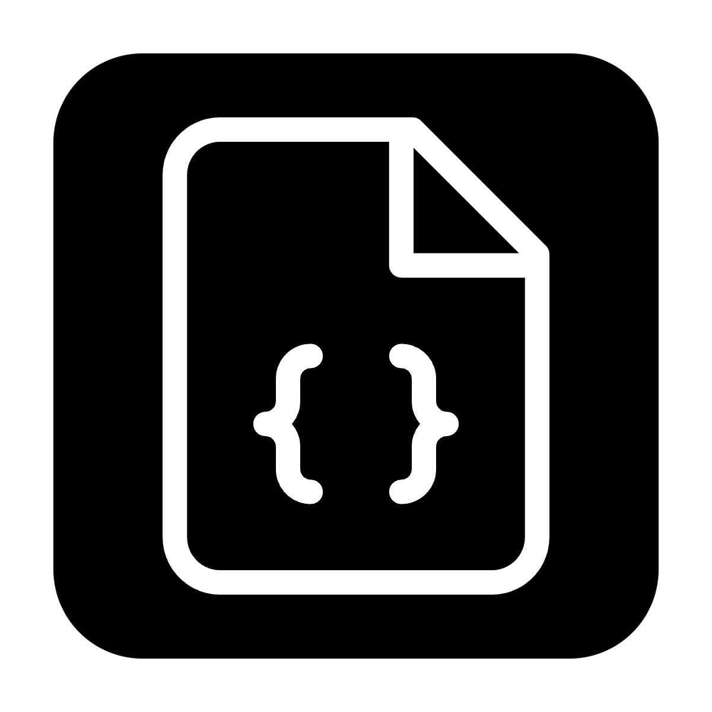

# Joblet - A Modern Job Board Application



## Overview

Joblet is a modern job board application built with Next.js 14, Prisma ORM, and Supabase. It enables companies to post job listings and users to browse and filter available positions based on location and job type. The application features a clean, responsive UI with secure authentication, comprehensive job management, and efficient search functionality.

## Live Demo

[View the live demo](https://joblet-omega.vercel.app)

## GitHub Repository

[View the GitHub repository](https://github.com/lutfifadlan/joblet)

## Features

- **Authentication** - Secure user authentication using Supabase Auth
- **Job Posting** - Authenticated users can create job listings
- **Job Browsing** - Public page to browse all job listings with filtering options
- **Job Details** - Detailed view of individual job listings
- **User Dashboard** - Manage your posted jobs (view, edit, delete)
- **Responsive Design** - Works seamlessly on desktop and mobile devices

## Tech Stack

- **Frontend**: Next.js 14 (App Router)
- **Backend**: Next.js API Routes with Prisma ORM
- **Database**: PostgreSQL (via Supabase)
- **Authentication**: Supabase Auth
- **Styling**: Tailwind CSS with shadcn/ui components
- **Deployment**: Vercel

## Setup Instructions

### Prerequisites

- Node.js 18+ or [Bun](https://bun.sh/) installed
- Supabase account (for database and authentication)
- Git

### Step 1: Clone the repository

```bash
git clone https://github.com/lutfifadlan/joblet.git
cd joblet
```

### Step 2: Install dependencies

Using npm:
```bash
npm install
```

Or using Bun (recommended for faster installation):
```bash
bun install
```

### Step 3: Set up Supabase

1. Create a new Supabase project at [supabase.com](https://supabase.com)
2. Set up authentication providers (Email, Google) in the Supabase dashboard
3. Create a custom Prisma user in the SQL Editor:

```sql
-- Create custom user
create user "prisma" with password 'your_secure_password' bypassrls createdb;

-- extend prisma's privileges to postgres
grant "prisma" to "postgres";

-- Grant necessary permissions
grant usage on schema public to prisma;
grant create on schema public to prisma;
grant all on all tables in schema public to prisma;
grant all on all routines in schema public to prisma;
grant all on all sequences in schema public to prisma;
alter default privileges for role postgres in schema public grant all on tables to prisma;
alter default privileges for role postgres in schema public grant all on routines to prisma;
alter default privileges for role postgres in schema public grant all on sequences to prisma;
```

### Step 4: Set up environment variables

Create a `.env.local` file in the root directory with the following variables:

```env
# Database connection (use the prisma user created above)
DATABASE_URL="postgres://prisma.[PROJECT-REF]:[PASSWORD]@[DB-REGION].pooler.supabase.com:5432/postgres"

# Supabase configuration
NEXT_PUBLIC_SUPABASE_URL=your_supabase_url
NEXT_PUBLIC_SUPABASE_ANON_KEY=your_supabase_anon_key

# Application URL
NEXT_PUBLIC_BASE_URL=http://localhost:3000

# Google OAuth (if using Google authentication)
GOOGLE_CLIENT_ID=your_google_client_id
GOOGLE_CLIENT_SECRET=your_google_client_secret
```

### Step 5: Run database migrations

```bash
npx prisma migrate dev --name initial
npx prisma generate
```

### Step 6: Start the development server

Using npm:
```bash
npm run dev
```

Or using Bun:
```bash
bun dev
```

### Step 7: Open your browser

Navigate to [http://localhost:3000](http://localhost:3000)

## Architecture Overview

### Project Structure

```text
/src
  /app                 # Next.js App Router
    /api               # API routes for server-side operations
      /auth            # Authentication endpoints
      /jobs            # Job management endpoints
      /users           # User endpoint
      /contacts        # Contact endpoint
    /dashboard         # User dashboard for managing job posts
    /jobs              # Job listings and detailed views
    /auth              # Authentication pages (login, signup)
    /contact-us        # Contact page
    /privacy-policy    # Privacy policy page
    /terms-of-service  # Terms of service page
  /components          # Reusable UI components
    /ui                # shadcn/ui components
    /magicui           # magicui components
    /custom-ui         # custom ui components
  /lib                 # Utility functions and shared code
    /supabase          # Supabase client configuration
/prisma                # Prisma schema and migrations
/public                # Static assets
```

### Technical Architecture

#### Frontend
- **Next.js 14 with App Router**: Server-side rendering and client-side navigation
- **React**: Component-based UI development
- **TypeScript**: Type safety throughout the application
- **Tailwind CSS**: Utility-first CSS framework for styling
- **shadcn/ui**: Reusable UI components built on Radix UI
- **React Hook Form**: Form validation and submission

#### Backend
- **Next.js API Routes**: Serverless functions for backend operations
- **Prisma ORM**: Type-safe database access and migrations
- **Supabase Auth**: Authentication and user management
- **PostgreSQL**: Relational database (hosted on Supabase)

#### Data Flow
1. **Authentication**: Users authenticate via Supabase Auth
2. **Data Access**: Authenticated requests access data through Next.js API routes
3. **Database Operations**: API routes use Prisma client to interact with PostgreSQL
4. **Rendering**: Data is rendered server-side or client-side depending on the page requirements

#### Deployment
- **Vercel**: Hosting platform optimized for Next.js applications
- **Supabase**: Database and authentication services

## Development Approach

The development of Joblet followed these key principles:

1. **User-Centered Design**: Focusing on creating an intuitive interface for both job posters and job seekers
2. **Modular Architecture**: Building reusable components and utilities to maintain clean code
3. **Progressive Enhancement**: Starting with core functionality and iteratively adding features
4. **Performance Optimization**: Ensuring fast page loads and responsive interactions
5. **Security First**: Implementing proper authentication and data protection measures

The development process included:

1. **Planning**: Defining requirements and scoping the project
2. **Setup**: Configuring Next.js, Prisma, and Supabase
3. **Core Development**: Building authentication, job posting, and browsing features
4. **UI Implementation**: Creating a responsive and accessible interface
5. **Testing & Refinement**: Manual testing and bug fixes
6. **Deployment**: Deploying to Vercel and configuring production environment

## Future Improvements

With additional time, these enhancements would be implemented:

1. **Advanced Search**: Full-text search with relevance ranking for job listings
2. **Job Applications**: Direct application submission and tracking system
3. **Company Profiles**: Dedicated pages for companies with branding and multiple job listings
4. **Email Notifications**: Automated alerts for new jobs matching user preferences
5. **Analytics Dashboard**: Insights for job posters about views, clicks, and applications
6. **Testing**: Comprehensive unit, integration, and end-to-end tests
7. **Mobile App**: Native mobile applications for iOS and Android
8. **AI-Powered Matching**: Intelligent job recommendations based on user profiles
9. **AI-Powered Job Fetching**: Pull job listings from reliable sources and display them on the job board automatically
10. **Magic Link and Google Sign In**: Use the magic link and Google sign-in for user authentication

## Original Task Requirements

### Overview

Given 3 days time, build a simple "Mini Job Board" web application where companies can post jobs and users can browse them. Focus on clean code, usability, and fullstack functionality.

### Requirements

#### Core Features

- Authentication (Supabase Auth)
  - Users can sign up and log in.
- Post a Job
  - Authenticated users can create job posts with:
    - Title
    - Company name
    - Description
    - Location
    - Job type (Full-Time, Part-Time, Contract)
- Browse Jobs
  - Public page showing a list of job postings.
  - Filter by location or job type.
- Job Detail Page
  - View full details of a specific job.
- User Dashboard
  - View, edit, or delete jobs that the user posted.

### Tech Requirements

- Frontend: Next.js (use app router)
- Backend: Supabase (for database + auth)
- Deployment: Deploy to Vercel and share the link
- Styling: Use any CSS framework (Tailwind CSS is preferred)

### Deliverables

1. GitHub repo link with clear README (setup instructions, approach, and architecture overview) - make it public github project
2. Live deployed URL (on Vercel)
3. Include a brief "What would you improve if given more time?" section in the README

## Prisma Setup

### 1. Create a custom user for Prisma

- In the SQL Editor, create a Prisma DB user with full privileges on the public schema.
- This gives you better control over Prisma's access and makes it easier to monitor using Supabase tools like the Query Performance Dashboard and Log Explorer.

```sql
-- Create custom user
create user "prisma" with password 'custom_password' bypassrls createdb;

-- extend prisma's privileges to postgres (necessary to view changes in Dashboard)
grant "prisma" to "postgres";

-- Grant it necessary permissions over the relevant schemas (public)
grant usage on schema public to prisma;
grant create on schema public to prisma;
grant all on all tables in schema public to prisma;
grant all on all routines in schema public to prisma;
grant all on all sequences in schema public to prisma;
alter default privileges for role postgres in schema public grant all on tables to prisma;
alter default privileges for role postgres in schema public grant all on routines to prisma;
alter default privileges for role postgres in schema public grant all on sequences to prisma;
```

### 2. Create a Prisma Project

- Initialize Prisma:

  ```bash
  npx prisma init
  ```

- In your .env file, set the DATABASE_URL variable to your connection string:

  ```env
  DATABASE_URL="postgres://[DB-USER].[PROJECT-REF]:[PRISMA-PASSWORD]@[DB-REGION].pooler.supabase.com:5432/postgres"
  ```

- Change your string's [DB-USER] to prisma and add the password you created in step 1:

  ```
  postgres://prisma.[PROJECT-REF]...
  ```

### 3. Create migrations

- Create new tables in your schema.prisma file:

  ```prisma
  model Post {
    id        Int     @id @default(autoincrement())
    title     String
    content   String?
    published Boolean @default(false)
    author    User?   @relation(fields: [authorId], references: [id])
    authorId  Int?
  }

  model User {
    id    Int     @id @default(autoincrement())
    email String  @unique
    name  String?
    posts Post[]
  }
  ```

- Run the migration:

  ```bash
  npx prisma migrate dev --name first_prisma_migration
  ```

### 4. Install prisma client

```bash
npm install @prisma/client
npx prisma generate
```

## Performance Optimizations

Joblet implements several performance optimizations:

1. **Server Components**: Using Next.js 14 server components to reduce client-side JavaScript
2. **Image Optimization**: Automatic image optimization via Next.js Image component
3. **Route Prefetching**: Preloading linked pages for faster navigation
4. **Edge Caching**: Leveraging Vercel's edge network for faster content delivery
5. **Optimized Database Queries**: Efficient Prisma queries with proper relations and selections

## Using Bun (Recommended)

[Bun](https://bun.sh) is recommended over npm for this project. Bun is an all-in-one JavaScript runtime & toolkit designed for speed, complete with a bundler, test runner, and Node.js-compatible package manager.

- **Installation**: Follow the instructions at https://bun.sh to install Bun locally
- **Usage**: Use `bun` instead of `npm` for all package.json commands
- **Lock File**: The project uses `bun.lock` instead of `package-lock.json`
- **Performance**: Bun provides significantly faster installation and development server startup times
